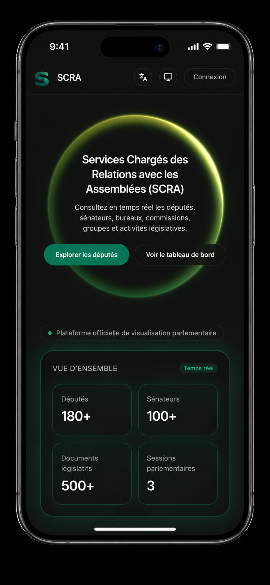
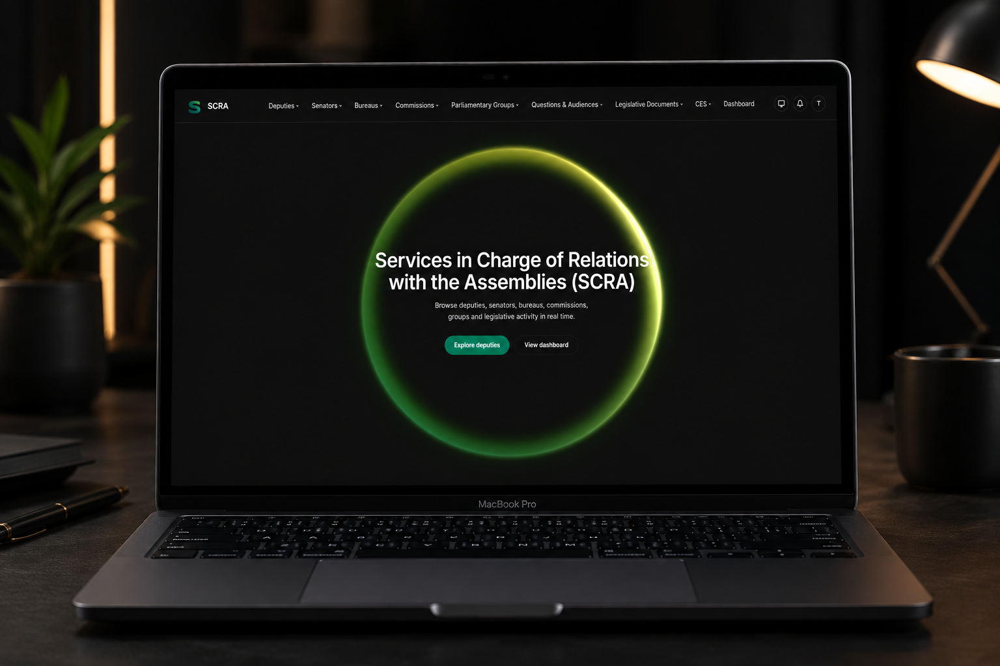

  

 

 

Hello World! I'm **Paul Hervé** — a Full-Stack Web Developer who enjoys turning real problems into clean, working software.

- 🎓 **Bachelor's Degree in Software Engineering** — The ICT University *(2025)*
- 💻 Building web applications since **2022**
- 🏛️ Designed and built the software architecture for the **Services in Charge of Relations with the Assemblies (SCRA)**, Republic of Cameroon — my first real-world engineering solution, live at [scra-cameroun.online](https://www.scra-cameroun.online/)
- 🚧 Currently refining my personal [portfolio](https://paulherveph.vercel.app/)
- 🌱 Always exploring new tools across the full stack — from databases to deployment
- 📫 Let's connect — links below

 

**Languages**

        

**Frontend & Frameworks**

         

**Backend & APIs**

           

**Databases**

    

**DevOps & Tools**

         

**Deployment & Hosting**

   

**Design**

  

 

<table>
<tr>
<td width="45%" valign="middle">

</td>
<td width="55%" valign="middle">

### SCRA IS

A digital platform built for the **Services in Charge of Relations with the Assemblies (SCRA)** at the Republic of Cameroon, to modernize and automate the tracking of the Cameroonian legislative process, parliamentary activity, and the work of the Economic and Social Council (CES).

It replaces a manual, error-prone system — one made more complex by a bicameral parliament and the CES — with a structured, reliable digital workflow. This was my first real-world software architecture solution, from design through implementation.

</td>
</tr>
</table>

 

### SCRA IS — Desktop View

 

 

<picture>
  <source media="(prefers-color-scheme: dark)" srcset="https://raw.githubusercontent.com/paulherveph/paulherveph/output/github-snake-dark.svg"/>
  <source media="(prefers-color-scheme: light)" srcset="https://raw.githubusercontent.com/paulherveph/paulherveph/output/github-snake.svg"/>
  
</picture>

 

<i>Thanks for stopping by — let's build something great together.</i>
